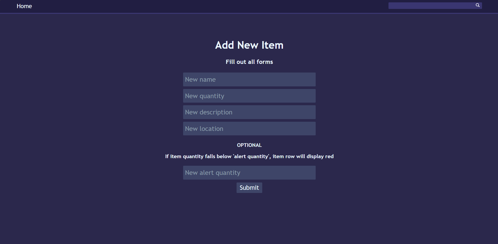

# inventory-system-piston
Inventory system for the IT department at Piston Automotive in Wentzville, MO
Created using, Python, Flask, HTML, CSS, and SQlite. Deployed using Waitress. Follows CRUD fundamental operations.

This software has a login page, a home page that displays all current items in the inventory, a search feature, a sort feature, and add/delete/edit features.

Deployed locally for the IT deparment to utilize to keep track of the number of imporant items such as labels which are used on the lines everyday, and if they were to run out would halt production.

