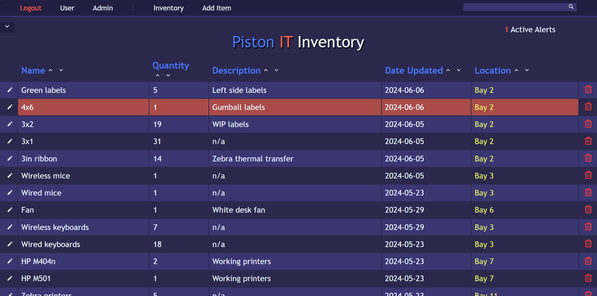

# inventory-system-piston
Inventory system for the IT department at Piston Automotive in Wentzville, MO
Created during a summer internship. (Due to company protocol, never used by any one other then myself when deployed locally from my work computer).

# Tech Stack

Front end:
- JS/HTML/CSS
- Jinja2
  
Back end:
- Flask
- Python
- SQLite
- SQLAlchemy

Deployed using Waitress. Follows CRUD fundamental operations.

# Features

This web application allows IT employees to view, edit, add, and delete items from a database. The item database uses SQLite. Users can also sort the data table by ascending or descending values by column.

There is a login page that requires a username and password. Only the admin account can add or delete users.
All passwords are hashed and salted using werkzeug.security and stored in a SQL table.
All views besides the login are protected, and admin only pages require the admin role to view.

Deployed locally for the IT deparment to keep track of inventory, including labels which are used everyday and are a critical part of production.

# What I Learned

This project was created using Python-Flask and grew my knowledge with the framework. 
During the creation of this project I gained profiency in SQL.
I had many issues related to front-end development that required me to troubleshoot, debug, and consult the documentation for various frameworks.

Examples:
Home page

Add item page

Edit item page

